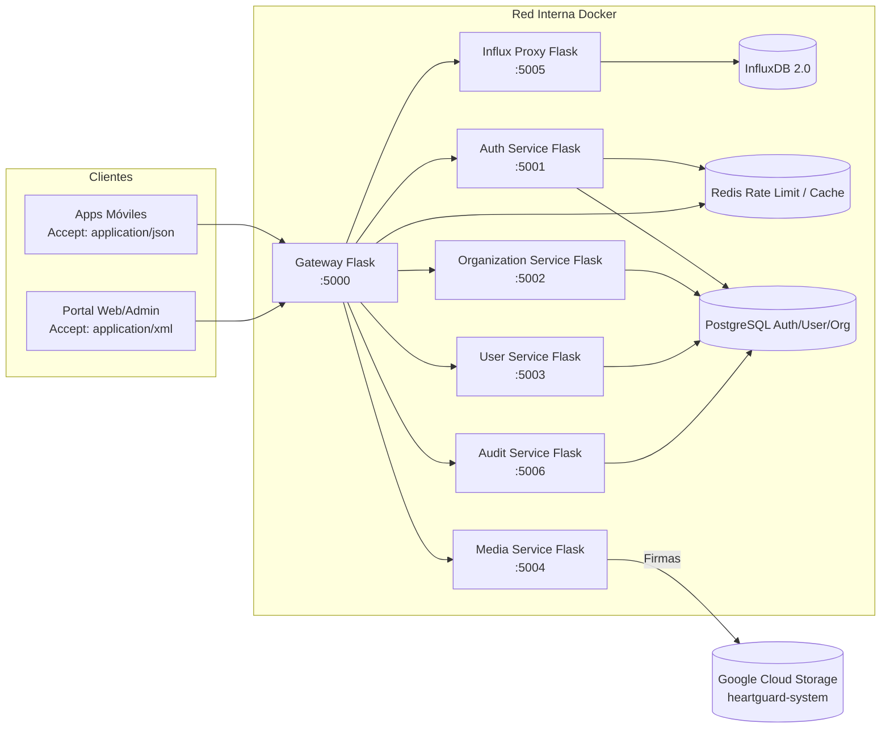

# Plan Técnico Integral – Arquitectura de Microservicios HeartGuard

## 1. Visión General
El objetivo es desplegar un ecosistema de microservicios construidos **exclusivamente con Flask** que cubra autenticación, datos maestros, gestión multimedia, ingestión de series de tiempo y auditoría. Todos los servicios deberán operar detrás de un Gateway que aplique validaciones de seguridad, CORS y control de tráfico. Se soportarán respuestas **JSON (Mobile/usuario)** y **XML (Web/Admin)** mediante negociación basada en el encabezado `Accept`; las operaciones de escritura validarán `Content-Type` (`application/json` o `application/xml`).

### 1.1 Diagrama de Arquitectura


## 2. Estructura de Carpetas
```
Microservicios/
├── PLAN.md
├── docker-compose.yml
├── .env.example
├── start_services.sh
├── stop_services.sh
├── validate_endpoints.sh
├── schemas/
│   ├── auth_token.schema.json
│   ├── auth_token.xsd
│   ├── media_item.schema.json
│   ├── media_item.xsd
│   ├── organization.schema.json
│   ├── organization.xsd
│   ├── timeseries.schema.json
│   ├── timeseries.xsd
│   ├── user.schema.json
│   └── user.xsd
└── services/
    ├── gateway/
    │   ├── requirements.txt
    │   └── src/
    │       ├── app.py
    │       └── utils.py
    ├── auth/
    │   ├── requirements.txt
    │   └── src/
    │       ├── app.py
    │       ├── db.py
    │       └── security.py
    ├── organization/
    │   ├── requirements.txt
    │   └── src/
    │       ├── app.py
    │       └── db.py
    ├── user/
    │   ├── requirements.txt
    │   └── src/
    │       ├── app.py
    │       └── db.py
    ├── media/
    │   ├── requirements.txt
    │   └── src/
    │       ├── app.py
    │       └── storage.py
    ├── influx/
    │   ├── requirements.txt
    │   └── src/
    │       ├── app.py
    │       └── influx_client.py
    └── audit/
        ├── requirements.txt
        └── src/
            ├── app.py
            └── db.py
```

## 3. Dependencias Clave por Servicio
- **Comunes:** Flask, PyJWT, werkzeug (hashing), python-dotenv, requests, dicttoxml.
- **Gateway:** Flask-Limiter (o implementación propia in-memory/Redis), redis, requests.
- **Auth:** SQLAlchemy + PostgreSQL (o SQLite en desarrollo), bcrypt/werkzeug, redis (lista de revocación), PyJWT.
- **Organization / User / Audit:** SQLAlchemy, marshmallow para validación ligera (opcional), PyJWT.
- **Media:** google-cloud-storage, mimetypes, base64, SQLAlchemy.
- **Influx:** influxdb-client, pandas opcional para agregaciones.
- **Infra:** Redis (rate limit + token cache), PostgreSQL (persistencia relacional), InfluxDB 2.0, contenedor de carga GCS (no local, se usará API externa).

> Nota: Para mantener la instrucción de "exclusivamente Flask", solo se emplean extensiones/librerías de apoyo, evitando frameworks alternativos.

## 4. Seguridad
- **JWT**: firmado con `JWT_SECRET`, `JWT_EXPIRES_IN` (minutos) y refresh con `REFRESH_TOKEN_TTL`. Tokens incluyen `sub`, `role`, `org_id`, `iat`, `exp`, `jti`.
- **Refresh tokens**: guardados en tabla `refresh_tokens` (Auth) con revocación explícita y TTL; lista de revocación en Redis como fallback.
- **RBAC**: roles `admin`, `manager`, `user`. Gateway aplica política: rutas administrativas requieren `admin`; Organization PUT requiere `admin` o `manager`; Media delete requiere `admin`.
- **Input Sanitization**: limpieza con `html.escape`, validación de payload contra JSON Schema/XSD cuando aplique.
- **CORS**: Gateway aplica cabeceras dinámicas (`Access-Control-Allow-Origin`, etc.) basado en `ALLOWED_ORIGINS`.
- **Rate Limiting**: token bucket por IP + usuario. Configurable por `.env` (ej. `RATE_LIMIT=100/min`). Redis recomendado en producción.
- **TLS**: Terminación en Nginx/Load Balancer externo. Certificados y forwarding no cubiertos en este repo.
- **Secrets**: variables de entorno, nunca en código duro. Para GCS se utilizará `GOOGLE_APPLICATION_CREDENTIALS` apuntando a JSON descargable en la VM.

## 5. Observabilidad
- **Logs estructurados JSON**: cada servicio implementa `before_request` para generar `request_id` (UUID) y logger estándar con campos `timestamp`, `service`, `request_id`, `path`, `latency_ms`, `status`.
- **Métricas**: endpoint `/metrics` por servicio con contadores simples (requests totales, errores, latencia promedio). Se puede exportar en formato Prometheus-compatible (texto) para integración con Prometheus.
- **Health Checks**: `/health` (liveness) y `/ready` (disponibilidad de dependencias) según corresponda.
- **Audit Trail**: microservicio Audit almacena eventos consumidos vía HTTP (POST `/audit/events`). Otros servicios envían eventos clave (login, cambios de datos, uploads) de forma asíncrona (best effort) usando colas en futuro (RabbitMQ/ PubSub).

## 6. Endpoints y Flujos Principales

### 6.1 Gateway (`:5000`)
- `GET /gateway/health` – Liveness.
- `GET /gateway/metrics` – Métricas.
- `ANY /auth/*, /organization/*, /users/*, /media/*, /timeseries/*, /audit/*` – Proxy hacia servicios destino con validación JWT y RBAC.
- `OPTIONS /*` – Respuesta CORS.

**Flujo:**
1. Cliente envía solicitud con `Accept` y opcional `Authorization`.
2. Gateway aplica rate limit (IP + user) consultando Redis/memoria.
3. Si ruta requiere auth, valida JWT (`Authorization: Bearer`). Si `jti` revocado consulta Auth (`/auth/token/introspect`).
4. Proxy la solicitud preservando encabezados `Accept`, `Content-Type`, `X-Request-ID`.
5. Agrega `X-Gateway-Request-ID` y registra evento en Audit.

### 6.2 Auth Service (`:5001`)
- `POST /auth/register` – Registro de usuario. Requiere JSON/XML válido (`email`, `password`, `role`...).
- `POST /auth/login` – Devuelve tokens `access_token`, `refresh_token`.
- `POST /auth/refresh` – Reemite par de tokens (revoca refresh anterior).
- `POST /auth/logout` – Revoca `jti` activo.
- `GET /auth/profile` – Datos del usuario actual.
- `GET /auth/roles` – Catálogo roles.
- `POST /auth/token/introspect` – Valida token/JTI para Gateway.
- `GET /auth/health` y `/auth/ready`.
- `GET /auth/metrics`.

**Ejemplo JSON**:
```json
POST /auth/login
{
  "email": "admin@heartguard.io",
  "password": "Secret123"
}
```
**Respuesta JSON**:
```json
{
  "access_token": "<jwt>",
  "refresh_token": "<jwt>",
  "expires_in": 3600,
  "token_type": "Bearer"
}
```
**Respuesta XML**:
```xml
<LoginResponse>
  <access_token>&lt;jwt&gt;</access_token>
  <refresh_token>&lt;jwt&gt;</refresh_token>
  <expires_in>3600</expires_in>
  <token_type>Bearer</token_type>
</LoginResponse>
```

### 6.3 Organization Service (`:5002`)
- `GET /organization` – Obtiene datos de la organización del `org_id` del token.
- `PUT /organization` – Actualiza información institucional (solo `admin/manager`).
- `GET /organization/policies` – Políticas.
- `GET /organization/health`, `/organization/metrics`.

### 6.4 User Service (`:5003`)
- `GET /users/me` – Perfil del usuario autenticado.
- `PUT /users/me` – Actualiza preferencias.
- `GET /users/{id}` – Solo `admin`.
- `GET /users/health`, `/users/metrics`.

### 6.5 Media Service (`:5004`)
- `POST /media/upload` – Sube archivo (`file_name`, `content_type`, `data_base64`). Valida tamaño máximo (`MAX_UPLOAD_MB`). Guarda metadata y sube a `gs://heartguard-system/`.
- `GET /media/items` – Lista archivos por usuario/org.
- `GET /media/items/{id}/download` – Retorna URL firmada temporal.
- `DELETE /media/items/{id}` – Elimina de GCS + metadata (rol `admin`).
- `GET /media/health`, `/media/metrics`.

### 6.6 Influx Microservice (`:5005`)
- `POST /timeseries/write` – Ingesta lotes (line protocol / JSON). Valida `bucket`, `org`, `points` con tags/fields.
- `POST /timeseries/query` – Consulta con parámetros `measurement`, `range_start`, `range_stop`, `aggregate`.
- `POST /timeseries/buckets` – Crea bucket y política de retención.
- `GET /timeseries/buckets` – Lista buckets.
- `DELETE /timeseries/buckets/{bucket}` – Elimina bucket.
- `GET /timeseries/health`, `/timeseries/ready`, `/timeseries/metrics`.

### 6.7 Audit Service (`:5006`)
- `POST /audit/events` – Registro de eventos estructurados (servicio, actor, acción, payload).
- `GET /audit/events` – Consulta paginada (solo `admin`).
- `GET /audit/health`, `/audit/metrics`.

## 7. Manejo Uniforme de Errores
- Clase `ServiceError` con código interno, mensaje, estatus HTTP.
- Decorador `@handle_errors` envuelve endpoints para responder en JSON/XML con estructura:
  - `{"error": {"code": "AUTH_001", "message": "Invalid credentials"}}`
  - `<Error><code>AUTH_001</code><message>Invalid credentials</message></Error>`
- Registra error en logs con `level=error`, `request_id`, `stack`.
- Para validaciones usa JSON Schema/XSD: si falla -> `422 Unprocessable Entity`.

## 8. Despliegue en VM (34.70.7.33)
1. Clonar repositorio: `git clone`.
2. Copiar credenciales GCP (`service-account.json`) a `/opt/heartguard/service-account.json`.
3. Crear archivo `.env` en `Microservicios/` basado en `.env.example` (definir secretos, URLs, credenciales DB/Inlfux/GCS).
4. Instalar Docker + Docker Compose (si no están).
5. Ejecutar `./start_services.sh` (envía `docker-compose up -d --build`).
6. Verificar con `docker-compose logs -f gateway` y `./validate_endpoints.sh` desde máquina local (configurar `GATEWAY_HOST=34.70.7.33`).
7. Para detener: `./stop_services.sh`.

## 9. Estrategia de Datos
- **PostgreSQL**: un esquema `heartguard_core` con tablas `users`, `organizations`, `user_preferences`, `refresh_tokens`, `revoked_tokens`, `audit_events`.
- **InfluxDB**: bucket por organización (prefijo `org_<id>`). Microservicio maneja tokens y se conecta usando `INFLUX_URL`, `INFLUX_TOKEN`, `INFLUX_ORG`.
- **GCS**: carpeta `/org_<id>/user_<id>/` para objetos. Firmas de URL válidas 15 minutos (`SIGNED_URL_TTL`).

## 10. Seguridad Operacional
- Auto-rotación de JWT secret y refresh tokens cada 90 días.
- Backup automático Postgres (pg_dump) diario, exportado a GCS.
- Logs sensibles redactados (ej. tokens). Audit service enmascara PII.
- Uso de `iptables`/firewall en VM para exponer solo puerto 5000.
- Fail2ban opcional para SSH.

## 11. Próximos Pasos / Roadmap
1. Integrar mensajería (Pub/Sub) para eventos de auditoría asincrónicos.
2. Añadir pruebas automatizadas (pytest) y pipelines CI/CD.
3. Integrar Prometheus + Grafana usando endpoints `/metrics`.
4. Añadir Webhooks para notificaciones externas.

## 12. Ejemplos de Solicitudes y Respuestas (resumen)

| Servicio | Endpoint | Ejemplo Solicitud JSON | Ejemplo Respuesta XML |
|----------|----------|------------------------|-----------------------|
| Auth | `POST /auth/register` | `{ "email": "user@hg.io", "password": "Secret123", "role": "admin" }` | `<RegisterResponse><user_id>1</user_id><email>user@hg.io</email></RegisterResponse>` |
| Organization | `PUT /organization` | `{ "name": "HeartGuard", "policies": "ISO27001" }` | `<Organization><id>1</id><name>HeartGuard</name><policies>ISO27001</policies></Organization>` |
| User | `PUT /users/me` | `{ "preferences": { "lang": "es" } }` | `<User><id>1</id><preferences><lang>es</lang></preferences></User>` |
| Media | `POST /media/upload` | `{ "file_name": "logo.png", "content_type": "image/png", "data_base64": "iVBORw0..." }` | `<MediaItem><id>uuid</id><file_name>logo.png</file_name></MediaItem>` |
| Influx | `POST /timeseries/write` | `{ "bucket": "org_1", "points": [{ "measurement": "heart_rate", "tags": {"user_id": "1"}, "fields": {"bpm": 72}, "timestamp": "2024-06-01T10:00:00Z" }] }` | `<WriteResult><success>true</success><inserted>1</inserted></WriteResult>` |
| Audit | `POST /audit/events` | `{ "actor": "user@hg.io", "action": "LOGIN", "service": "auth" }` | `<AuditEvent><id>uuid</id><status>recorded</status></AuditEvent>` |

## 13. Scripts Operativos
- `start_services.sh`: exporta variables, ejecuta `docker-compose up -d --build` y espera health checks.
- `stop_services.sh`: `docker-compose down`.
- `validate_endpoints.sh`: secuencia de `curl` para JSON/XML con medición de latencia (`time_total`), imprime tabla de resultados y estatus global.

## 14. Testing
- Pruebas unitarias (no incluidas) recomendadas con pytest y coverage >80%.
- `validate_endpoints.sh` servirá como smoke test post despliegue.

