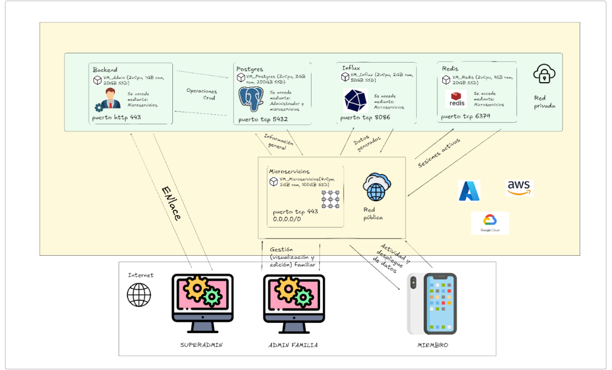
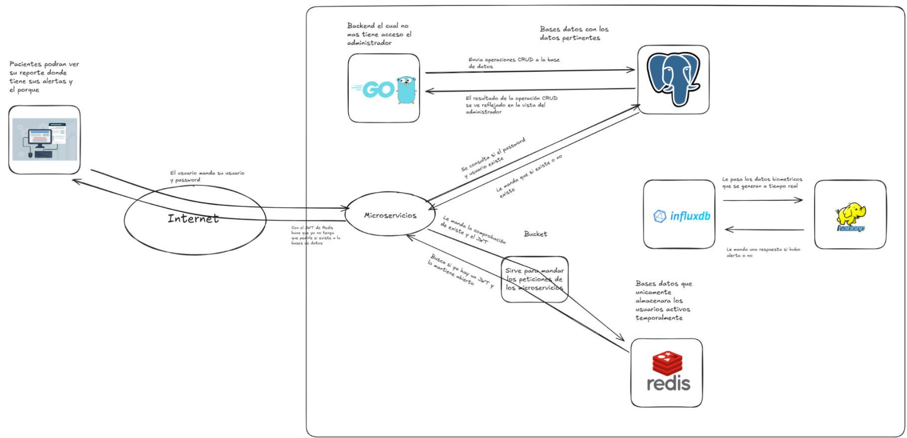

# HeartGuard - Sistema de Monitoreo de Salud Familiar

## 🏥 Descripción del Sistema

HeartGuard es un sistema de monitoreo de salud familiar con un **Superadministrador** que gestiona familias y usuarios a nivel global. El sistema está diseñado para monitorear la salud de miembros de familias a través de métricas fisiológicas en tiempo real.

### 🏗️ Arquitectura de hardware del Sistema


### 🏗️ Arquitectura de software del Sistema


## 🚀 Inicio Rápido

### Prerrequisitos

- **Docker Desktop** (instalar desde [docker.com](https://www.docker.com/products/docker-desktop/))
- **Git** (opcional, para clonar repositorio)

### 1. Clonar el Repositorio

```bash
git clone https://github.com/eduardogarzab/HeartGuard.git
cd HeartGuard
```

### 2. Levantar los Servicios

```bash
cd backend
docker-compose up -d
```

Esto iniciará:
- **PostgreSQL** (puerto 5432) - Base de datos principal
- **InfluxDB** (puerto 8086) - Base de datos de series de tiempo
- **Redis** (puerto 6379) - Cache y sesiones
- **Backend Go** (puerto 8080) - API REST y Web Dashboard

### 3. Acceder al Sistema

#### 🌐 Interfaz Web (Recomendado)
```
URL: http://localhost:8080
Email: admin@heartguard.com
Password: admin123
```

#### 🧪 Pruebas con Scripts

**En Mac/Linux:**
```bash
cd ..
./test.sh
```

**En Windows:**
```cmd
cd ..
test.bat
```

### 4. Verificar que Funciona

**Verificar en navegador:**
- Abrir: http://localhost:8080/
- Hacer login con las credenciales del superadmin

**Ver estado de servicios:**
```bash
cd backend
docker-compose ps
```

## 🎯 Funcionalidades del Superadministrador

### 👥 Gestión de Usuarios
- ✅ **Crear usuarios** con roles específicos
- ✅ **Editar usuarios** existentes
- ✅ **Eliminar usuarios** (excepto el superadmin)
- ✅ **Asignar usuarios a familias**
- ✅ **Filtrar usuarios** por nombre o familia

### 🏠 Gestión de Familias
- ✅ **Crear familias** nuevas
- ✅ **Editar familias** existentes
- ✅ **Eliminar familias**
- ✅ **Ver estadísticas** de miembros por familia
- ✅ **Filtrar familias** por nombre

### 🚨 Gestión de Alertas
- ✅ **Ver todas las alertas** del sistema
- ✅ **Atender alertas** pendientes
- ✅ **Filtrar alertas** por usuario o tipo
- ✅ **Dashboard con estadísticas** de alertas

### 📊 Dashboard Ejecutivo
- ✅ **Estadísticas en tiempo real**
- ✅ **Contadores de usuarios, familias y alertas**
- ✅ **Estado de microservicios**
- ✅ **Logs del sistema**

### 📋 Logs del Sistema
- ✅ **Registro de todas las acciones**
- ✅ **Filtros por usuario y acción**
- ✅ **Timestamps detallados**

## 🔄 Inicialización del Backend

### 📋 Proceso de Inicialización

Cuando ejecutas `docker-compose up -d`, el sistema realiza la siguiente secuencia:

#### 1. **Creación de Bases de Datos**
```bash
# PostgreSQL se inicializa con init.sql
- Crea extensiones (uuid-ossp, pg_stat_statements, btree_gin)
- Crea tablas con índices optimizados
- Crea vistas para consultas complejas
- Crea stored procedures para operaciones CRUD
```

#### 2. **Inserción de Datos Base**
```bash
# Se insertan automáticamente:
- 3 roles: superadmin, admin_familia, miembro
- 3 familias de ejemplo: García, Rodríguez, López
- 1 superadmin: admin@heartguard.com / admin123
- 4 usuarios adicionales con diferentes roles
- Catálogos de tipos de alertas
- Microservicios de ejemplo
- Logs de inicialización
```

#### 3. **Creación de Stored Procedures**
```bash
# 13 stored procedures creados automáticamente:
- sp_dashboard_ejecutivo() - Resumen ejecutivo con métricas clave
- sp_get_usuarios() - Listar usuarios con filtros
- sp_create_alerta() - Crear nueva alerta
- sp_get_alertas() - Listar alertas con información de usuario y familia
- sp_atender_alerta() - Marcar alerta como atendida
- registrar_log_sistema() - Registrar acción en logs del sistema
- actualizar_estado_microservicio() - Actualizar estado de un microservicio
- sp_create_familia() - Crear nueva familia
- sp_update_familia() - Actualizar familia existente
- sp_get_familias() - Listar familias con estadísticas
- sp_get_dashboard_stats() - Obtener estadísticas generales del sistema
- sp_get_logs_sistema() - Listar logs del sistema con filtros
- crear_superadmin() - Función para crear superadmin (mencionada al inicio)
```

#### 4. **Inicialización de Servicios**
```bash
# Redis se configura para:
- Almacenar tokens JWT activos
- Cache de sesiones de usuario
- Cache de datos frecuentes

# InfluxDB se configura para:
- Futuras métricas fisiológicas
- Series de tiempo de dispositivos IoT
```

### 🎯 Comportamiento del Sistema

#### **Al Iniciar:**
1. **PostgreSQL** ejecuta `init.sql` automáticamente
2. **Redis** se inicializa para sesiones
3. **InfluxDB** se configura para métricas futuras
4. **Backend Go** se conecta a todas las bases de datos
5. **Web Dashboard** está disponible en http://localhost:8080

#### **Al Hacer Login:**
1. Se valida credenciales contra PostgreSQL
2. Se genera token JWT
3. Se almacena sesión activa en Redis
4. Se redirige al dashboard principal

#### **En el Dashboard:**
1. **Carga automática** de estadísticas del dashboard
2. **Navegación por secciones** (Usuarios, Familias, Alertas, etc.)
3. **Operaciones CRUD** en tiempo real
4. **Filtros y búsquedas** instantáneas
5. **Modales responsivos** para crear/editar

#### **Al Crear/Editar:**
1. Se validan datos en frontend
2. Se envían a backend via API REST
3. Se ejecutan stored procedures en PostgreSQL
4. Se actualiza Redis si es necesario
5. Se refresca la vista automáticamente

## 🔄 Comandos de Gestión

### Reiniciar el Sistema
```bash
# Detener servicios
cd backend
docker-compose down

# Iniciar servicios nuevamente
docker-compose up -d

# O todo en uno
docker-compose down && docker-compose up -d
```

### Limpiar Todo (Eliminar datos)
```bash
cd backend
docker-compose down -v
docker-compose up -d
```

### Ver Logs
```bash
cd backend
# Todos los servicios
docker-compose logs

# Solo el backend
docker-compose logs backend-go

# Seguir logs en tiempo real
docker-compose logs -f
```

### Reconstruir Backend
```bash
cd backend
docker-compose build --no-cache backend-go
docker-compose up -d backend-go
```

## 📡 API Endpoints

### Backend Go (Superadministrador) - Puerto 8080

#### Autenticación
- `POST /admin/login` - Iniciar sesión como superadministrador
- `POST /admin/logout` - Cerrar sesión

#### Dashboard y Estadísticas
- `GET /admin/dashboard` - Obtener estadísticas generales del sistema

#### Usuarios
- `GET /admin/usuarios` - Listar usuarios (con filtros)
- `POST /admin/usuarios` - Crear usuario
- `GET /admin/usuarios/:id` - Obtener usuario por ID
- `PUT /admin/usuarios/:id` - Actualizar usuario
- `DELETE /admin/usuarios/:id` - Eliminar usuario

#### Familias
- `GET /admin/familias` - Listar familias (con filtros)
- `POST /admin/familias` - Crear familia
- `GET /admin/familias/:id` - Obtener familia por ID
- `PUT /admin/familias/:id` - Actualizar familia
- `DELETE /admin/familias/:id` - Eliminar familia

#### Gestión de Relaciones
- `POST /admin/familias/asignar` - Asignar usuario a familia
- `POST /admin/familias/remover` - Remover usuario de familia

#### Alertas
- `GET /admin/alertas` - Listar alertas
- `POST /admin/alertas` - Crear alerta
- `PUT /admin/alertas/:id/atender` - Marcar alerta como atendida
- `DELETE /admin/alertas/:id` - Eliminar alerta

#### Catálogos
- `GET /admin/catalogos` - Listar catálogos
- `GET /admin/catalogos/:id` - Obtener catálogo por ID
- `POST /admin/catalogos` - Crear catálogo
- `PUT /admin/catalogos/:id` - Actualizar catálogo
- `DELETE /admin/catalogos/:id` - Eliminar catálogo

#### Logs del Sistema
- `GET /admin/logs` - Listar logs del sistema (con filtros)

#### Monitoreo de Microservicios
- `GET /admin/microservicios` - Consultar estado de microservicios
- `PUT /admin/microservicios/:id/estado` - Actualizar estado de un microservicio

## 🗄️ Estructura de Base de Datos

### PostgreSQL (Datos Estructurados)

# 🗄️ Estructura de Base de Datos (PostgreSQL)

## Tabla: `roles`
- `id` **SERIAL PRIMARY KEY**
- `nombre` **VARCHAR UNIQUE** — ('superadmin', 'admin_familia', 'miembro')
- `descripcion` **TEXT**
- `permisos` **JSONB**
- `fecha_creacion` **TIMESTAMP**

---

## Tabla: `familias`
- `id` **SERIAL PRIMARY KEY**
- `nombre_familia` **VARCHAR**
- `codigo_familia` **VARCHAR UNIQUE** — Código para que los usuarios se unan
- `fecha_creacion` **TIMESTAMP**

---

## Tabla: `usuarios`
- `id` **SERIAL PRIMARY KEY**
- `nombre` **VARCHAR**
- `email` **VARCHAR UNIQUE**
- `password_hash` **TEXT**
- `rol_id` **INT** → FK → `roles.id`
- `familia_id` **INT** → FK → `familias.id`
- `latitud` **DECIMAL** — Última ubicación conocida
- `longitud` **DECIMAL** — Última ubicación conocida
- `ultima_actualizacion` **TIMESTAMP**
- `fecha_creacion` **TIMESTAMP**

---

## Tabla: `alertas`
- `id` **SERIAL PRIMARY KEY**
- `usuario_id` **INT** → FK → `usuarios.id`
- `tipo` **VARCHAR**
- `descripcion` **TEXT**
- `nivel` **VARCHAR** — ('bajo', 'medio', 'alto', 'critico')
- `fecha` **TIMESTAMP**
- `atendida` **BOOLEAN**
- `fecha_atencion` **TIMESTAMP**
- `atendido_por` **INT** → FK → `usuarios.id`
- `latitud` **DECIMAL** — Ubicación origen
- `longitud` **DECIMAL** — Ubicación origen

---

## Tabla: `catalogos`
- `id` **SERIAL PRIMARY KEY**
- `tipo` **VARCHAR** — ('tipo_alerta', 'nivel_alerta', 'estado_sistema', etc.)
- `clave` **VARCHAR**
- `valor` **VARCHAR**
- `descripcion` **TEXT**
- `activo` **BOOLEAN**
- `fecha_creacion` **TIMESTAMP**

---

## Tabla: `logs_sistema`
- `id` **SERIAL PRIMARY KEY**
- `usuario_id` **INT** → FK → `usuarios.id` (puede ser nulo si la acción es del sistema)
- `accion` **VARCHAR** — ('LOGIN', 'CREATE_USER', 'SYSTEM_INIT', etc.)
- `detalle` **JSONB** — Información contextual
- `fecha` **TIMESTAMP**

---

## Tabla: `microservicios`
- `id` **SERIAL PRIMARY KEY**
- `nombre` **VARCHAR**
- `url` **VARCHAR**
- `estado` **VARCHAR** — ('activo', 'inactivo', 'error')
- `ultima_verificacion` **TIMESTAMP**
- `version` **VARCHAR**
- `descripcion` **TEXT**
- `fecha_creacion` **TIMESTAMP**

### Redis (Cache y Sesiones)

#### Claves de Sesión
- `session:{usuario_id}` → Token JWT activo
- `token:{token_hash}` → Información de sesión

#### Cache de Datos
- `familias:all` → Lista completa de familias
- `usuarios:stats` → Estadísticas de usuarios
- `alertas:pendientes` → Alertas no atendidas

### InfluxDB (Preparado para Métricas)

El sistema incluye InfluxDB configurado y listo para almacenar métricas fisiológicas cuando se implemente el microservicio de métricas.

## 🔒 Seguridad

### Autenticación
- JWT tokens con expiración configurable
- Contraseñas encriptadas con bcrypt
- Middleware de autenticación en endpoints protegidos
- Sesiones activas gestionadas en Redis

### Autorización
- Sistema de roles jerárquico:
  - **Superadmin**: Acceso completo al sistema
  - **Admin Familia**: Acceso a su familia específica
  - **Miembro**: Acceso limitado a sus datos

### Validación
- Validación de entrada en todos los endpoints
- Sanitización de datos
- Manejo de errores consistente
- Stored procedures para operaciones seguras

## 🛠️ Desarrollo

### Estructura del Proyecto
¡Claro, hermano\! Aquí tienes la estructura del proyecto actualizada y en el formato que te gusta. He revisado todos los archivos para asegurarme de que refleje exactamente cómo está organizado tu repositorio ahora.

### 🛠️ Estructura del Proyecto

```
HeartGuard/
├── backend/                  # Backend en Go para el Superadministrador
│   ├── docker-compose.yml    # Orquesta los servicios de backend y base de datos
│   ├── Dockerfile            # Define la imagen Docker para la app de Go
│   ├── main.go               # Punto de entrada principal de la aplicación
│   ├── crud.go               # Lógica para operaciones CRUD (Crear, Leer, Actualizar, Borrar)
│   ├── monitoring.go         # Endpoints y lógica para monitoreo
│   ├── init.sql              # Script de inicialización para la base de datos PostgreSQL
│   ├── go.mod                # Gestiona las dependencias del proyecto
│   ├── go.sum                # Hashes de las dependencias para seguridad
│   ├── static/               # Archivos estáticos para el dashboard web
│   │   ├── css/style.css     # Hoja de estilos principal
│   │   └── js/app.js         # Lógica JavaScript del frontend
│   └── templates/            # Plantillas HTML que renderiza el backend
│       └── index.html        # Página principal del dashboard
│
├── frontend/                 # Contiene todas las aplicaciones cliente
│   ├── cliente-admin/        # Cliente web para el administrador (HTML, CSS, JS)
│   │   ├── dashboard.html    # El panel de control principal
│   │   ├── login.html        # La página de inicio de sesión
│   │   └── assets/           # Recursos para el cliente web
│   │       ├── js/           # Scripts para la lógica del dashboard
│   │       └── styles.css    # Estilos para el cliente admin
│   │
│   └── frontend-movil/       # Aplicación nativa para Android (Kotlin)
│       ├── app/              # Código fuente principal de la app
│       ├── build.gradle.kts  # Script de construcción de la app
│       └── readme.md         # Instrucciones específicas para la app móvil
│
├── arquitecturadehardware.png # Diagrama de la arquitectura de hardware
├── arquitecturadesoftware.png # Diagrama de la arquitectura de software
├── README.md                 # La documentación principal del proyecto
└── LICENSE                   # La licencia del proyecto (MIT)
```

### Comandos de Desarrollo

```bash
# Levantar solo las bases de datos
docker-compose up -d postgres influxdb redis

# Reconstruir solo el backend
docker-compose up -d --build backend-go

# Ver logs del backend
docker-compose logs -f backend-go

# Entrar al contenedor de PostgreSQL
docker-compose exec postgres psql -U heartguard -d heartguard
```

### Variables de Entorno

#### Backend Go
```bash
DB_HOST=postgres
DB_PORT=5432
DB_USER=heartguard
DB_PASSWORD=heartguard123
DB_NAME=heartguard
REDIS_HOST=redis
REDIS_PORT=6379
JWT_SECRET=heartguard-jwt-secret-key-123
```

## 🌐 Servicios Disponibles

- **Backend Go + Web Dashboard**: http://localhost:8080
- **PostgreSQL**: localhost:5432
- **InfluxDB**: http://localhost:8086
- **Redis**: localhost:6379

## 🧪 Pruebas con cURL

### 1. Iniciar Sesión

```bash
curl -X POST http://localhost:8080/admin/login \
  -H "Content-Type: application/json" \
  -d '{
    "email": "admin@heartguard.com",
    "password": "admin123"
  }'
```

### 2. Listar Usuarios (con token)

```bash
curl -X GET http://localhost:8080/admin/usuarios \
  -H "Authorization: Bearer TU_TOKEN_AQUI"
```

### 3. Crear Familia (con token)

```bash
curl -X POST http://localhost:8080/admin/familias \
  -H "Content-Type: application/json" \
  -H "Authorization: Bearer TU_TOKEN_AQUI" \
  -d '{
    "nombre_familia": "Familia Martínez",
    "codigo_familia": "MARTINEZ2024",
    "descripcion": "Familia de ejemplo",
    "estado": true
  }'
```

### 4. Crear Usuario (con token)

```bash
curl -X POST http://localhost:8080/admin/usuarios \
  -H "Content-Type: application/json" \
  -H "Authorization: Bearer TU_TOKEN_AQUI" \
  -d '{
    "nombre": "Juan Pérez",
    "email": "juan.perez@email.com",
    "password": "password123",
    "rol_id": 2,
    "familia_id": 1,
    "relacion": "padre",
    "es_admin_familia": true
  }'
```

## 🆘 Solución de Problemas

### Error: "Backend no está corriendo"
```bash
# Verificar que Docker esté corriendo
docker --version

# Verificar estado de servicios
cd backend
docker-compose ps

# Ver logs
docker-compose logs
```

### Error: "No se puede conectar a la base de datos"
```bash
# Esperar a que PostgreSQL se inicialice
docker-compose logs postgres

# Verificar que esté "healthy"
docker-compose ps
```

### Error: "Stored procedure no existe"
```bash
# Recrear base de datos completa
docker-compose down -v
docker-compose up -d
```

### Error: "Modal no aparece"
```bash
# Verificar logs del navegador (F12)
# Reconstruir backend si es necesario
docker-compose up -d --build backend-go
```

## 🚀 Próximos Pasos

### 🔄 Funcionalidades Pendientes

#### 1. **Microservicio de Métricas Fisiológicas**
- Implementar microservicio Flask/Python para manejo de datos fisiológicos
- Integración con InfluxDB para métricas en tiempo real
- Endpoints para ingesta de datos de dispositivos IoT
- Dashboard de métricas en tiempo real

#### 2. **App Android**
- Desarrollar aplicación móvil que consuma los microservicios
- Interfaz para usuarios finales (no administradores)
- Notificaciones push para alertas
- Sincronización offline

#### 3. **Mejoras del Sistema Actual**
- Agregar más validaciones y reglas de negocio
- Implementar notificaciones en tiempo real
- Sistema de reportes y analytics avanzados
- Exportación de datos a Excel/PDF

#### 4. **Integración con Dispositivos IoT**
- Conectores para dispositivos de monitoreo
- Procesamiento de datos en tiempo real
- Alertas automáticas basadas en umbrales
- Machine Learning para detección de patrones


#### Dentro de la estructura del proyecto, se especifica que las siguientes carpetas contienen su propio archivo README.md con instrucciones detalladas:
backend/: Contiene el README.md específico para el servicio del Superadministrador en Go.
cliente-admin/: Contiene el README.md para el cliente web alternativo.
frontend-movil/: Contiene el README.md con los detalles sobre la aplicación móvil en desarrollo.


## 📝 Notas Importantes

- ✅ El sistema está **completamente funcional** como backend base
- ✅ Todas las bases de datos están configuradas y listas
- ✅ El sistema de autenticación y autorización está implementado
- ✅ Los datos de ejemplo se cargan automáticamente al iniciar
- ✅ El proyecto está **contenedorizado** para fácil despliegue
- ✅ **Web Dashboard** completamente funcional
- ✅ **Stored Procedures** optimizados para rendimiento
- ✅ **Sistema de roles** implementado y funcional

## 🤝 Contribuir

1. Fork el repositorio
2. Crear una rama para tu feature
3. Hacer commit de tus cambios
4. Push a la rama
5. Crear un Pull Request

## 📄 Licencia

Este proyecto está bajo la Licencia MIT. Ver el archivo `LICENSE` para más detalles.

---

**¡El sistema está listo para usar!** 🎉

Para empezar, ejecuta:
```bash
cd backend
docker-compose up -d
```

Luego ve a: **http://localhost:8080**
- **Email**: admin@heartguard.com
- **Password**: admin123
